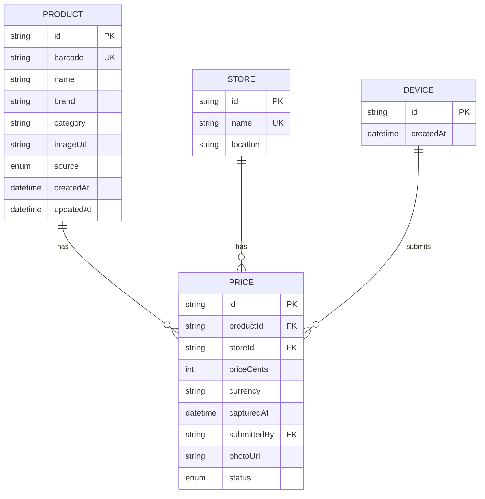

# ListaCerta API

NestJS + Prisma + PostgreSQL REST API for products, stores and prices.

## Stack

- NestJS (REST only)
- Prisma ORM
- PostgreSQL (Docker)
- Zod request validation
- Swagger (`/docs`)

## Run locally (Docker Compose)

From repo root:

```bash
docker compose up --build -d postgres api
```

API: `http://localhost:3001`

Swagger: `http://localhost:3001/docs`

Adminer: `http://localhost:8080`

## Run locally (host process)

```bash
cp apps/api/.env.example apps/api/.env
docker compose up -d postgres
npm install
npm run prisma:migrate -w @listacerta/api
npm run prisma:seed -w @listacerta/api
npm run dev -w @listacerta/api
```

## Endpoints

- `GET /products?q=&limit=`
- `GET /products/barcode/:barcode`
- `GET /products/:barcode` (legacy alias)
- `POST /products`
- `PATCH /products/:id`
- `POST /prices`
- `GET /prices/moderation?status=&limit=`
- `PATCH /prices/:id/moderation`
- `GET /prices/best/:productId`
- `GET /stores`
- `POST /stores`
- `GET /health`

## OpenFoodFacts integration (cache-aside)

`GET /products/:barcode` behavior:

1. Query local DB for product by barcode
2. If found: return local product
3. If missing: fetch from OpenFoodFacts API
4. Normalize + store in local DB (`source=OFF`)
5. Return stored product

## ER diagram


