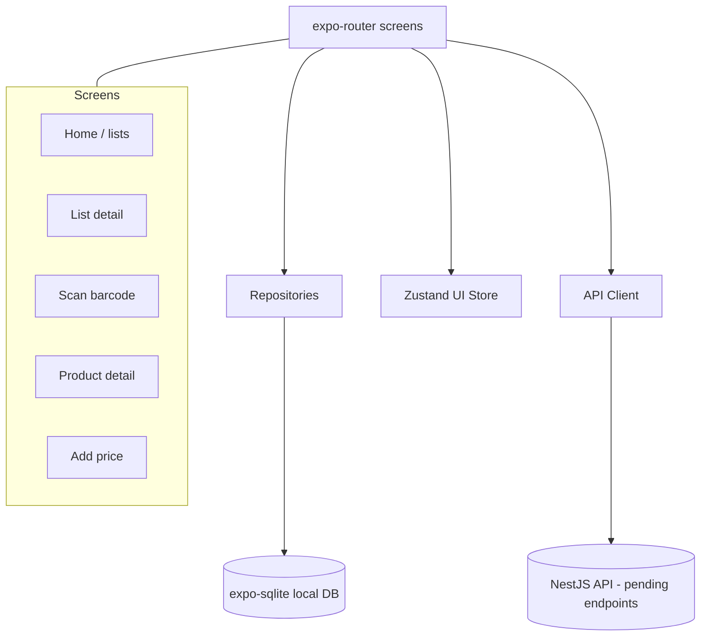

# ListaCerta Mobile (Expo)

Mobile app for ListaCerta built with:

- Expo (managed workflow)
- TypeScript
- `expo-router`
- `expo-sqlite`
- `expo-camera`
- Zustand (UI state only)

## Run with Expo Dev Client

From monorepo root:

```bash
npm install
npm run ios -w @listacerta/mobile
npm run dev:client -w @listacerta/mobile
```

Then launch the generated dev client on simulator and connect to Metro.

## Environment

Create `apps/mobile/.env`:

```bash
EXPO_PUBLIC_API_BASE_URL=http://localhost:3001
```

This value is used by `src/network/apiClient.ts`.

## Architecture



## SQLite schema (local-first)

Tables:

- `lists`
- `list_items`
- `products` (local cache)
- `stores`
- `prices` (local cache)

Migrations live in `src/db/migrations.ts` and run at app startup (`app/_layout.tsx`).

## Folder overview

```txt
apps/mobile
├── app/                  # expo-router routes
├── src/
│   ├── db/               # sqlite client, migrations, seed
│   ├── repositories/     # clean DB access layer
│   ├── network/          # API base client (stubs for now)
│   ├── state/            # Zustand UI-only state
│   └── domain/           # app model types
└── README.md
```

## Notes

- Networking layer is intentionally scaffolded only (no endpoint implementation yet).
- Reanimated / VisionCamera are intentionally not used.
