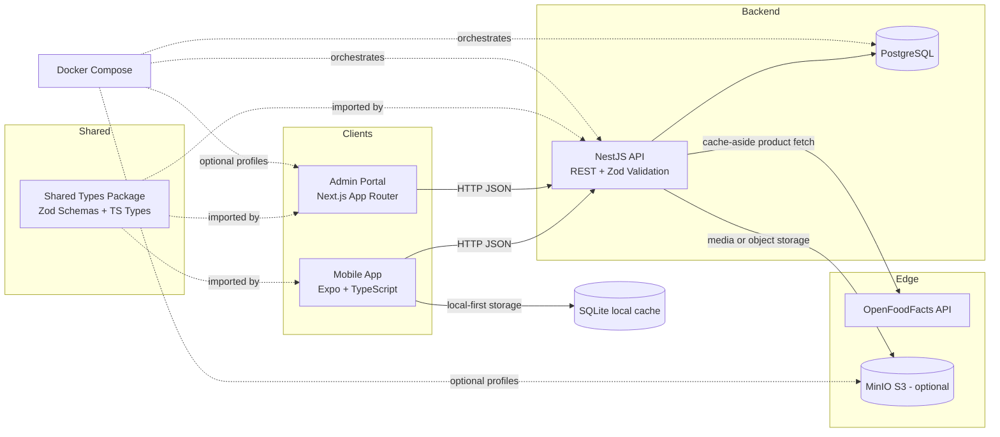

# System Architecture

```mermaid
flowchart LR
  subgraph Clients
    Mobile["Mobile App<br/>Expo + TypeScript"]
    Admin["Admin Portal<br/>Next.js App Router"]
  end

  subgraph Shared
    SharedTypes["Shared Types Package<br/>Zod Schemas + TS Types"]
  end

  subgraph Backend
    API["NestJS API<br/>REST + Zod Validation"]
    DB[(PostgreSQL)]
  end

  subgraph Edge
    OFF[OpenFoodFacts API]
    MinIO[(MinIO S3 - optional)]
  end

  MobileSQLite[(SQLite local cache)]
  Compose[Docker Compose]

  Mobile -->|HTTP JSON| API
  Admin -->|HTTP JSON| API

  Mobile -->|local-first storage| MobileSQLite

  API --> DB
  API -->|cache-aside product fetch| OFF
  API -->|media or object storage| MinIO

  SharedTypes -. imported by .-> Mobile
  SharedTypes -. imported by .-> API
  SharedTypes -. imported by .-> Admin

  Compose -. orchestrates .-> API
  Compose -. orchestrates .-> DB
  Compose -. optional profiles .-> Admin
  Compose -. optional profiles .-> MinIO
```
