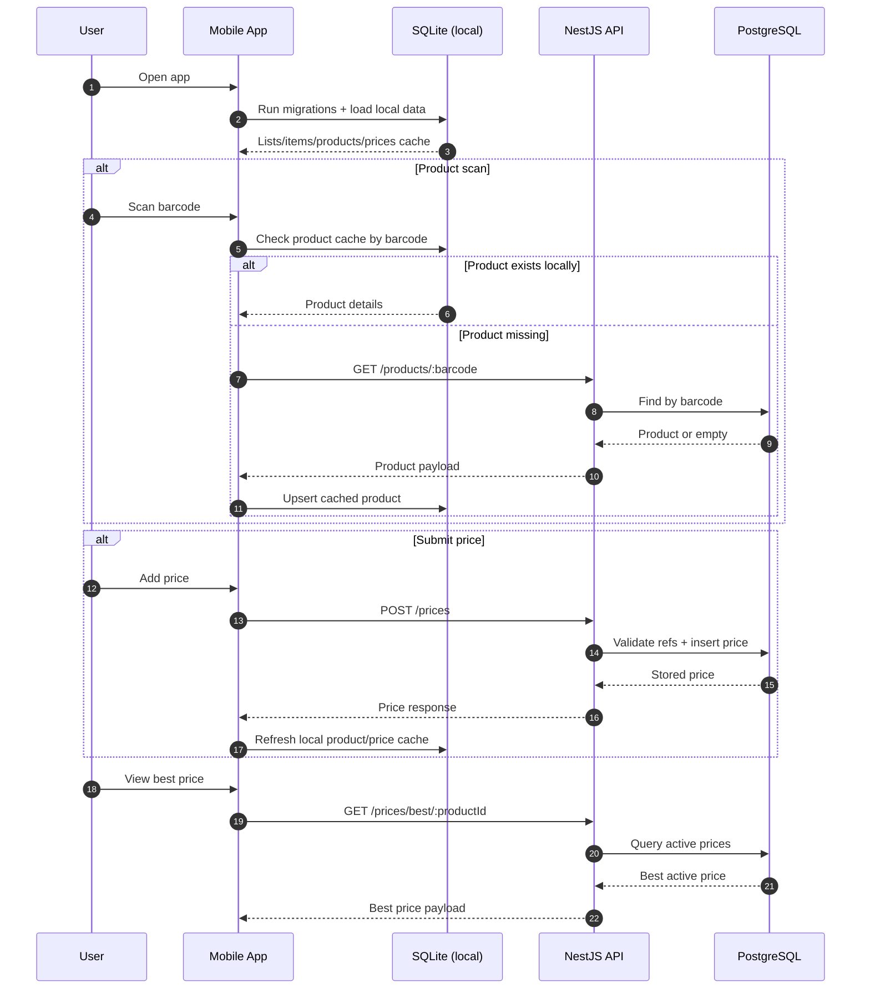

# Mobile ↔ API Flow

```mermaid
sequenceDiagram
  autonumber
  participant User
  participant Mobile as Mobile App
  participant LocalDB as SQLite (local)
  participant API as NestJS API
  participant PG as PostgreSQL

  User->>Mobile: Open app
  Mobile->>LocalDB: Run migrations + load local data
  LocalDB-->>Mobile: Lists/items/products/prices cache

  alt Product scan
    User->>Mobile: Scan barcode
    Mobile->>LocalDB: Check product cache by barcode
    alt Product exists locally
      LocalDB-->>Mobile: Product details
    else Product missing
      Mobile->>API: GET /products/:barcode
      API->>PG: Find by barcode
      PG-->>API: Product or empty
      API-->>Mobile: Product payload
      Mobile->>LocalDB: Upsert cached product
    end
  end

  alt Submit price
    User->>Mobile: Add price
    Mobile->>API: POST /prices
    API->>PG: Validate refs + insert price
    PG-->>API: Stored price
    API-->>Mobile: Price response
    Mobile->>LocalDB: Refresh local product/price cache
  end

  User->>Mobile: View best price
  Mobile->>API: GET /prices/best/:productId
  API->>PG: Query active prices
  PG-->>API: Best active price
  API-->>Mobile: Best price payload
```
