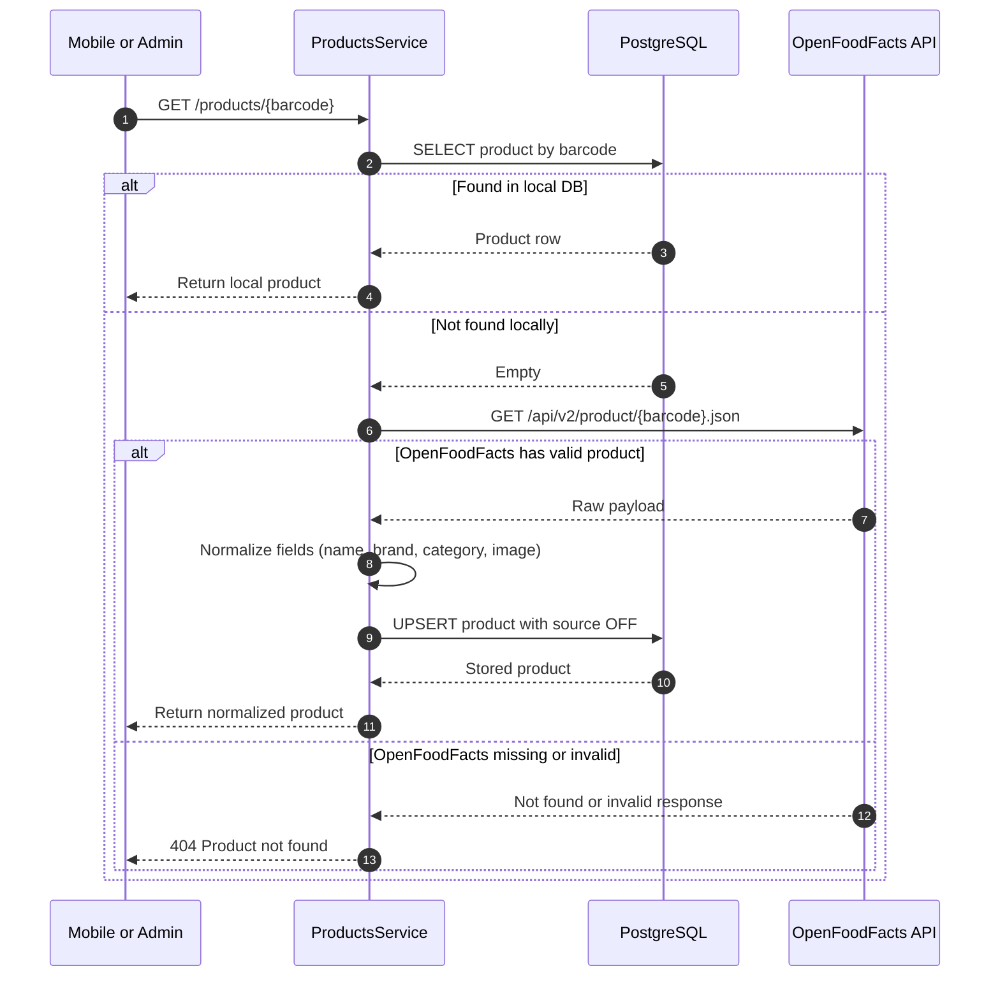

# OpenFoodFacts Integration Flow (Cache-Aside)

## Normalization rules

- Name: prefer primary product name field, reject empty values.
- Brand: first brand token when multiple are provided.
- Category: sanitize OFF tags to readable values.
- Image URL: choose available front/product image URL.
- Source: persisted as `OFF` for traceability.
