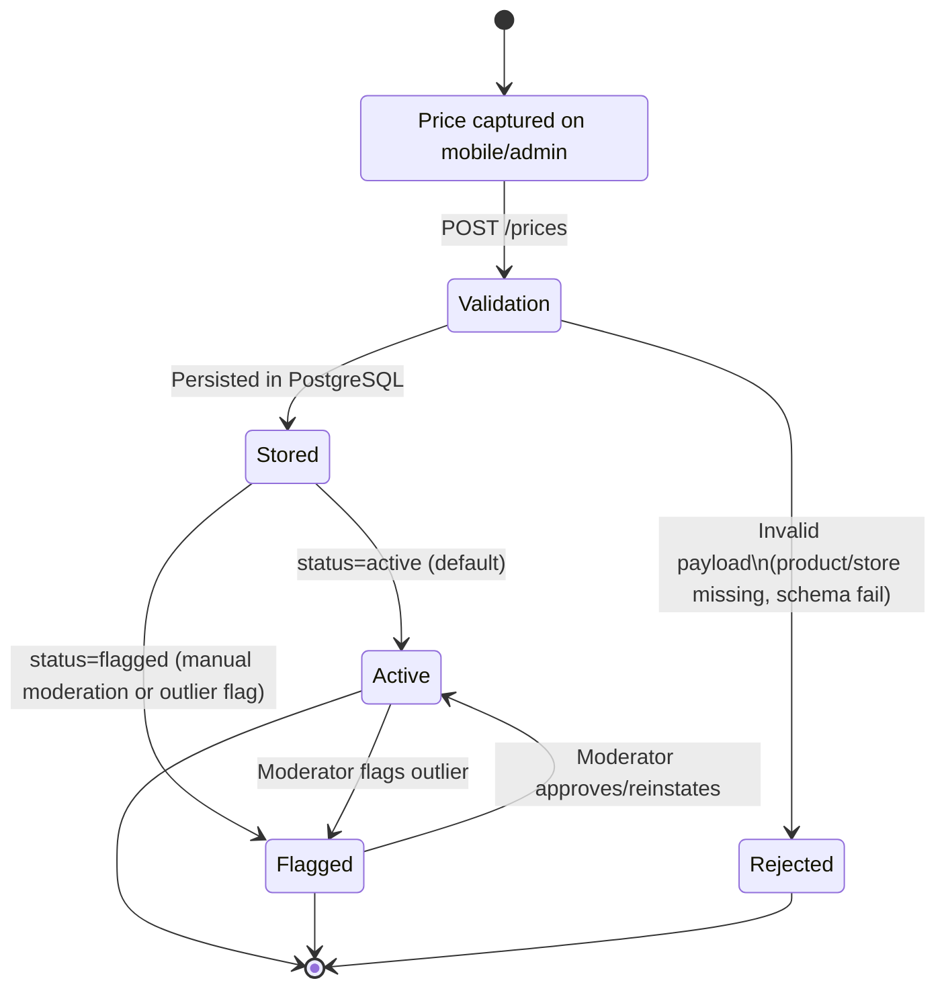

# Price Submission Lifecycle

## Practical behavior

1. Client submits `productId`, `storeId`, `priceCents`, `currency` (+ optional metadata).
2. API validates payload and relations.
3. API creates/links device when `submittedBy` is present.
4. Price is stored with lifecycle state (`active` or `flagged`).
5. Moderation endpoint can transition status between `active` and `flagged`.
