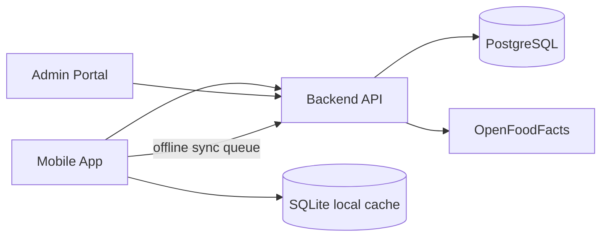
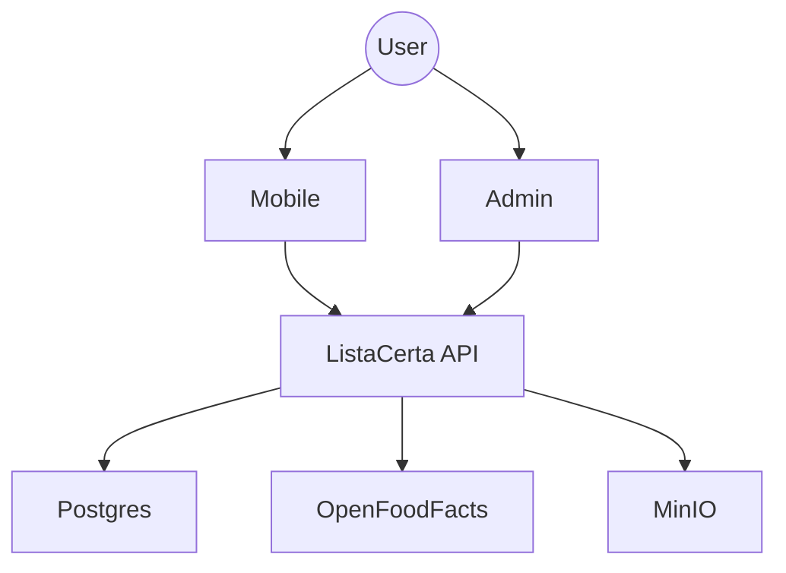

# ListaCerta Documentation Index

## 1) Architecture Overview

### System architecture

### System context

## 2) Global Diagrams
- [System Architecture](./diagrams/system-architecture.md)
- [System Context](./diagrams/system-context.md)
- [Database ER Diagram](./diagrams/database-er.md)
- [Price Submission Lifecycle](./diagrams/price-submission-lifecycle.md)
- [Offline Sync Lifecycle](./diagrams/offline-sync-lifecycle.md)

## 3) Feature Inventory and Coverage
- [Feature Inventory Table](./feature-inventory.md)
- [API Route Coverage](./api-reference.md)
- [Mobile Screen Coverage](./mobile-screens.md)
- [Completeness Check](./completeness-check.md)

## 4) Implemented Feature Docs
- [Feature 01 — Barcode Product Lookup](./features/feature-01-barcode-product-lookup.md)
- [Feature 02 — Add Product to Shopping List](./features/feature-02-add-product-to-shopping-list.md)
- [Feature 03 — Submit Product Price](./features/feature-03-submit-product-price.md)
- [Feature 04 — Best Price Aggregation](./features/feature-04-best-price-aggregation.md)
- [Feature 05 — Store CRUD](./features/feature-05-store-crud.md)
- [Feature 06 — Price Moderation](./features/feature-06-price-moderation.md)
- [Feature 07 — Product Search](./features/feature-07-product-search.md)
- [Feature 08 — Price History](./features/feature-08-price-history.md)
- [Feature 09 — Offline Sync](./features/feature-09-offline-sync.md)
- [Feature 10 — Anonymous Device Identity](./features/feature-10-anonymous-device-identity.md)
- [Feature 11 — Product Editing in Admin](./features/feature-11-product-editing-admin.md)
- [Feature 12 — Basic Analytics](./features/feature-12-basic-analytics.md)

## 5) Roadmap (Implemented vs Planned)

### Implemented
- Features 01 through 12 listed above
- Admin devices monitoring tab
- Dockerized local stack with optional profiles

### Planned / Partial
- Mini line chart rendering for price history (currently list-first)
- OCR accuracy enhancements for complex shelf labels (current heuristic scoring)
- Optional richer sync observability UI (pending queue count/badge)

## 6) Screenshot Directory
All screenshot artifacts referenced by feature docs are under:
- `./screenshots/`
