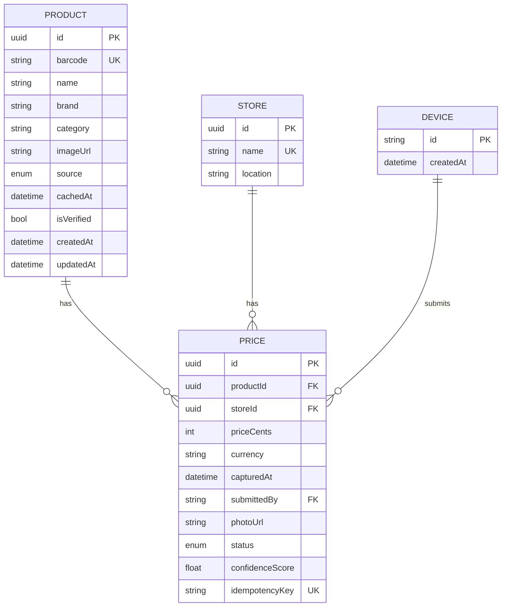

# Global Diagram B — Database ER

```mermaid
erDiagram
  PRODUCT ||--o{ PRICE : has
  STORE ||--o{ PRICE : has
  DEVICE ||--o{ PRICE : submits

  PRODUCT {
    uuid id PK
    string barcode UK
    string name
    string brand
    string category
    string imageUrl
    enum source
    datetime cachedAt
    bool isVerified
    datetime createdAt
    datetime updatedAt
  }

  STORE {
    uuid id PK
    string name UK
    string location
  }

  DEVICE {
    string id PK
    datetime createdAt
  }

  PRICE {
    uuid id PK
    uuid productId FK
    uuid storeId FK
    int priceCents
    string currency
    datetime capturedAt
    string submittedBy FK
    string photoUrl
    enum status
    float confidenceScore
    string idempotencyKey UK
  }
```
