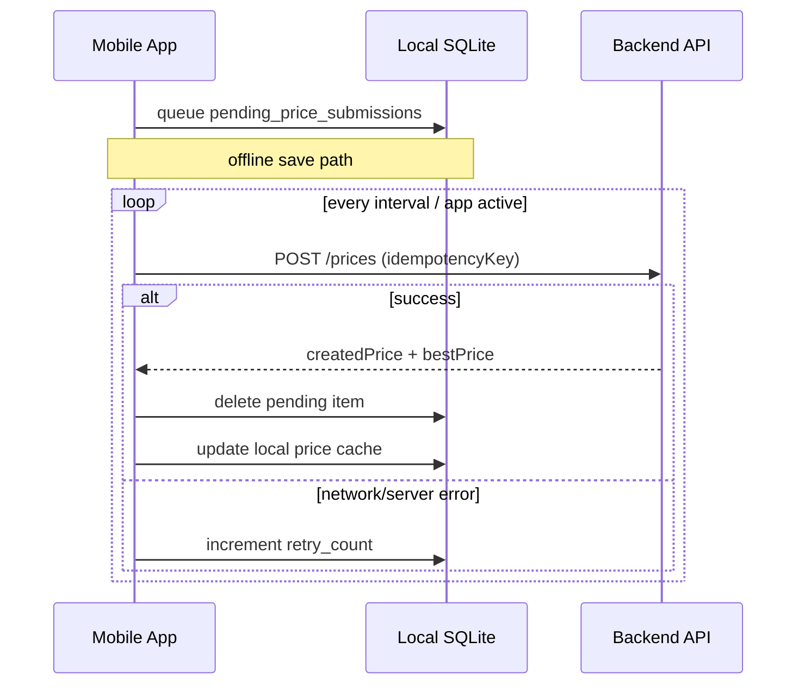

# Global Diagram D — Offline Sync Lifecycle

```mermaid
sequenceDiagram
  participant App as Mobile App
  participant SQLite as Local SQLite
  participant API as Backend API

  App->>SQLite: queue pending_price_submissions
  Note over App,SQLite: offline save path

  loop every interval / app active
    App->>API: POST /prices (idempotencyKey)
    alt success
      API-->>App: createdPrice + bestPrice
      App->>SQLite: delete pending item
      App->>SQLite: update local price cache
    else network/server error
      App->>SQLite: increment retry_count
    end
  end
```
