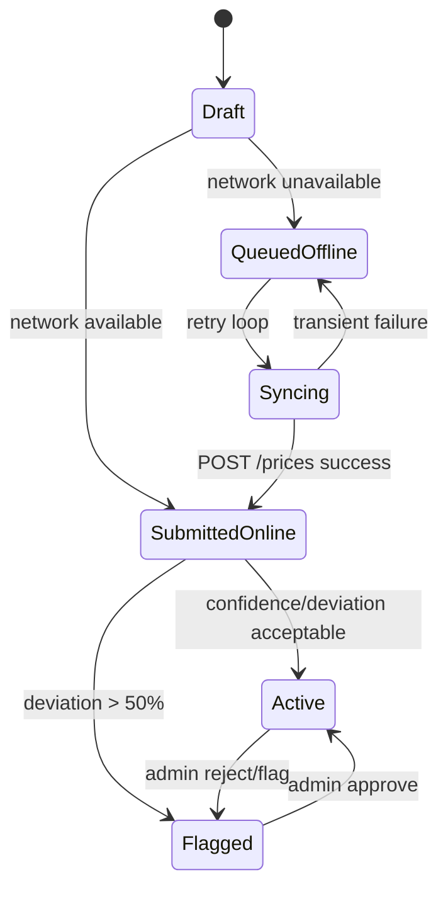

# Global Diagram C — Price Submission Lifecycle

```mermaid
stateDiagram-v2
  [*] --> Draft
  Draft --> SubmittedOnline: network available
  Draft --> QueuedOffline: network unavailable
  QueuedOffline --> Syncing: retry loop
  Syncing --> SubmittedOnline: POST /prices success
  Syncing --> QueuedOffline: transient failure

  SubmittedOnline --> Active: confidence/deviation acceptable
  SubmittedOnline --> Flagged: deviation > 50%
  Flagged --> Active: admin approve
  Active --> Flagged: admin reject/flag
```
