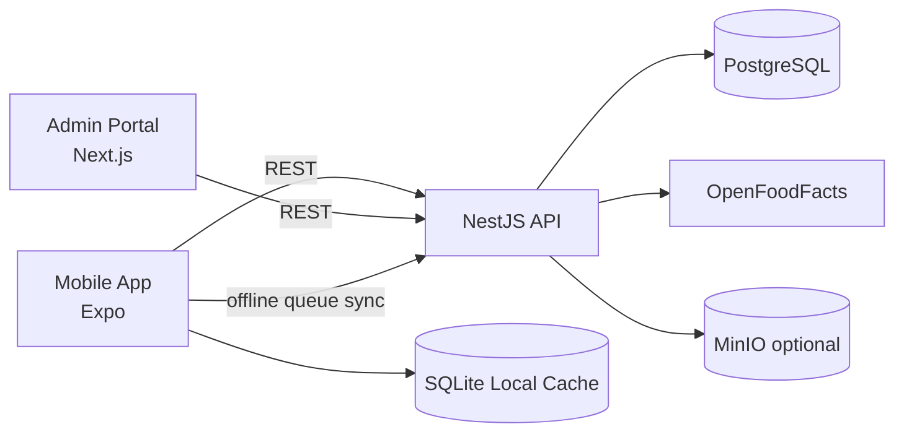

# Global Diagram A — System Architecture

```mermaid
flowchart LR
  M[Mobile App\nExpo] -->|REST| API[NestJS API]
  ADM[Admin Portal\nNext.js] -->|REST| API
  API --> PG[(PostgreSQL)]
  API --> OFF[OpenFoodFacts]
  M --> SQ[(SQLite Local Cache)]
  M -->|offline queue sync| API
  API --> MINIO[(MinIO optional)]
```
