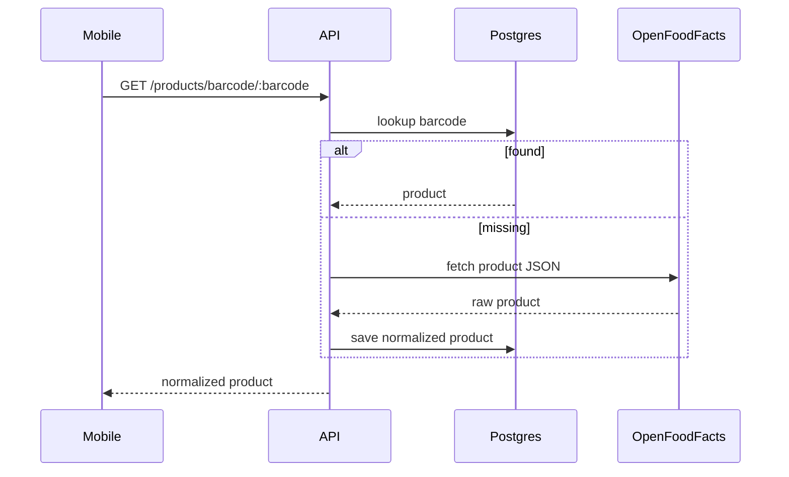
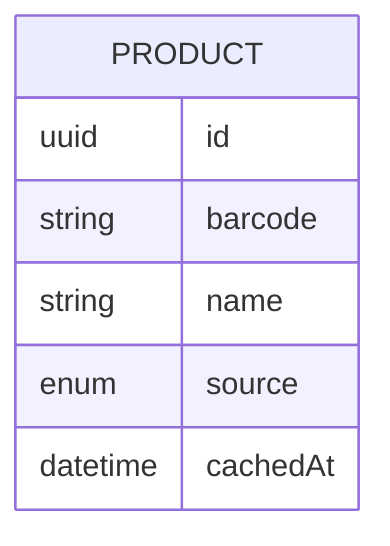

# Feature 01 — Barcode Product Lookup

## 1. Goal
Allow a user to scan a barcode in mobile and retrieve normalized product information via backend cache-aside logic (local DB first, OpenFoodFacts fallback).

## 2. User Flow
1. User opens **Scan barcode** screen (`/scan`) in mobile.
2. Mobile scans barcode with `expo-camera`.
3. Mobile calls backend `GET /products/barcode/:barcode`.
4. API checks `Product` table by barcode.
5. If missing, API fetches OpenFoodFacts, normalizes fields, stores product (`source=OFF`, `cachedAt`).
6. API returns internal product schema.
7. Mobile upserts product into local SQLite cache and opens Product Detail (`/products/[id]`).

## 3. Screenshots
- Mobile UI: `../screenshots/feature01-barcode-mobile.png`
- API evidence: `../screenshots/feature01-barcode-api.png`
- DB evidence: `../screenshots/feature01-barcode-db.png`

## 4. API Contract
- **Endpoint:** `/products/barcode/:barcode`
- **Method:** `GET`
- **Request example:**
```http
GET /products/barcode/7622210449283
```
- **Response example:**
```json
{
  "id": "3d1a...",
  "barcode": "7622210449283",
  "name": "Product Name",
  "brand": "Brand",
  "category": "snacks",
  "imageUrl": "https://...",
  "source": "OFF",
  "cachedAt": "2026-02-25T08:00:00.000Z",
  "isVerified": false,
  "createdAt": "2026-02-25T08:00:00.000Z",
  "updatedAt": "2026-02-25T08:00:00.000Z"
}
```

## 5. Database Impact
- **Tables:** `Product` (Postgres), `products` (SQLite cache)
- **Schema snippet (Postgres):** `barcode`, `name`, `brand`, `category`, `imageUrl`, `source`, `cachedAt`
- **Indexes:** `Product.barcode` unique index

## 6. Edge Cases
- Barcode unknown in local DB and OFF: API returns 404.
- Mobile 404 fallback creates local draft product for manual completion.
- Network failures surface URL-aware error message in mobile alert.

## 7. Mermaid Diagrams



