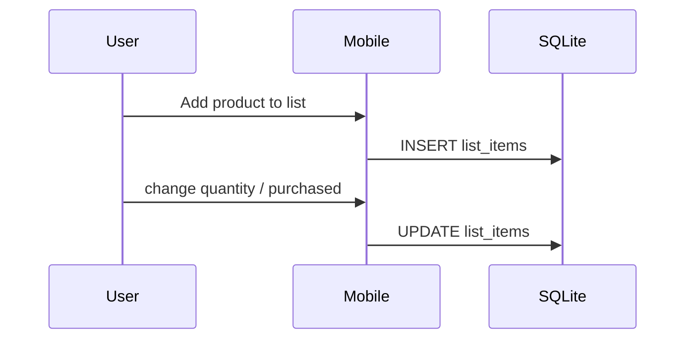
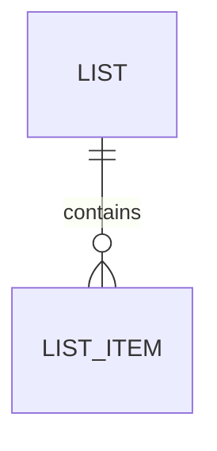

# Feature 02 — Add Product to Shopping List

## 1. Goal
Enable adding a scanned/searched product to a selected local shopping list, including quantity management and purchased status.

## 2. User Flow
1. User opens Product Detail (`/products/[id]`).
2. User taps **Add product to list**.
3. Mobile opens list selection modal (existing lists + inline list creation).
4. Mobile inserts row into SQLite `list_items`.
5. User can adjust quantity in list screen and toggle purchased state.

## 3. Screenshots
- Mobile product/list flow: `../screenshots/feature02-list-mobile.png`
- SQLite evidence: `../screenshots/feature02-list-db.png`

## 4. API Contract
- No backend contract (local-only MVP).

## 5. Database Impact
- **Tables:** `lists`, `list_items` (SQLite)
- **Schema snippet:** `list_items(id, list_id, title, quantity, done, created_at)`
- **Indexes:** `idx_list_items_list_id`

## 6. Edge Cases
- No lists available: modal supports inline list creation.
- Quantity lower bound enforced at 1.
- Persisted locally and survives restart.

## 7. Mermaid Diagrams

