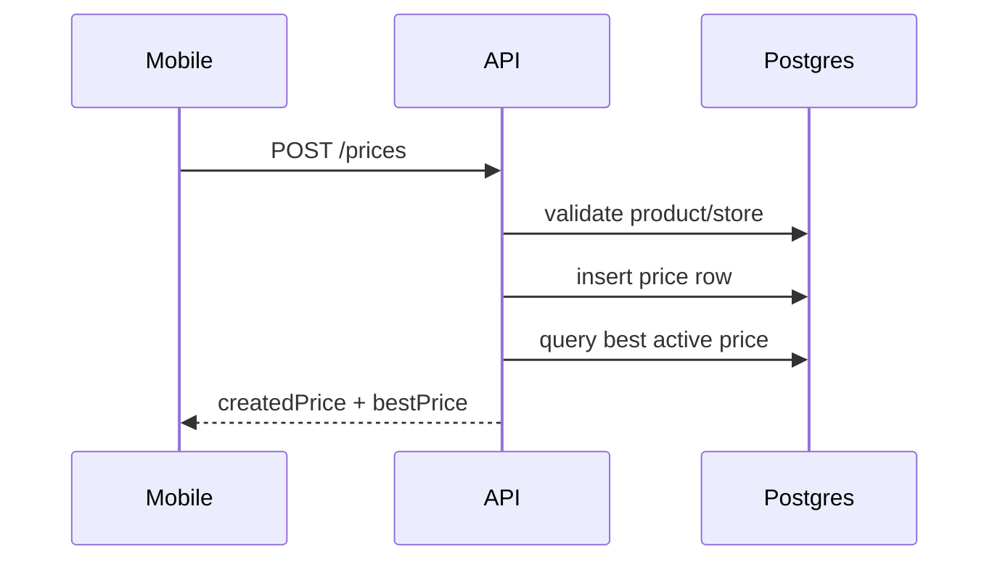
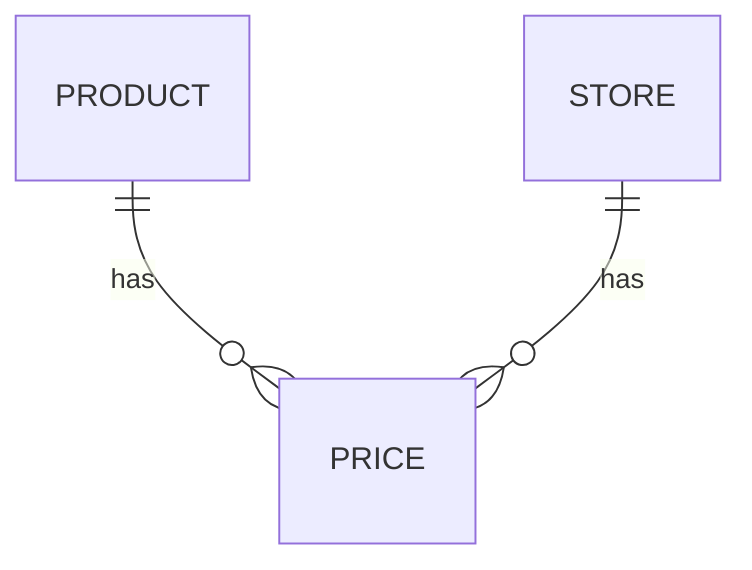

# Feature 03 — Submit Product Price

## 1. Goal
Allow user to submit product prices for a selected store, with backend validation and best-price recalculation.

## 2. User Flow
1. User opens Product Detail and taps **Add price** (`/prices/add`).
2. User selects store (default preselected), enters value (or OCR capture), and submits.
3. Mobile posts price data to API.
4. API validates product/store IDs, stores append-only price row, computes best active price.
5. Mobile caches returned created/best prices locally.

## 3. Screenshots
- Mobile Add Price screen: `../screenshots/feature03-price-mobile.png`
- API evidence: `../screenshots/feature03-price-api.png`
- Admin moderation visibility: `../screenshots/feature03-price-admin.png`

## 4. API Contract
- **Endpoint:** `/prices`
- **Method:** `POST`
- **Request body example:**
```json
{
  "productId": "uuid",
  "storeId": "uuid",
  "priceCents": 299,
  "currency": "EUR",
  "capturedAt": "2026-02-25T10:00:00.000Z",
  "status": "active",
  "photoUrl": null,
  "idempotencyKey": "price_uuid"
}
```
- **Response example:**
```json
{
  "createdPrice": { "id": "...", "priceCents": 299, "status": "active" },
  "bestPrice": { "id": "...", "priceCents": 249, "status": "active" }
}
```

## 5. Database Impact
- **Tables:** `Price`, `Store`, `Product`, `Device` (Postgres); `prices`, `stores` (SQLite)
- **Indexes:** `Price(productId,status,priceCents)`, `Price(storeId)`, `Price(capturedAt)`

## 6. Edge Cases
- Invalid product/store => 404.
- Invalid payload => 400.
- OCR module unavailable => friendly fallback message.

## 7. Mermaid Diagrams



