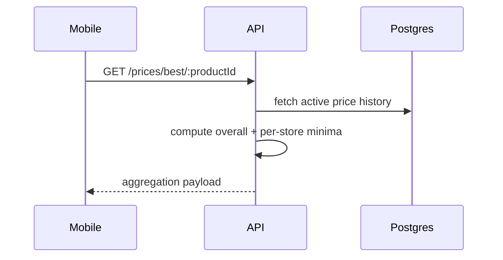
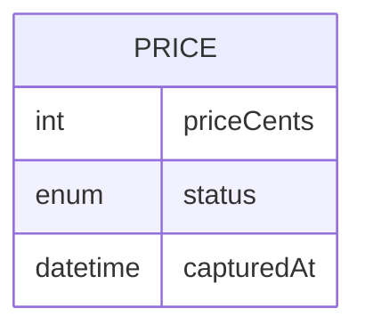

# Feature 04 — Best Price Aggregation

## 1. Goal
Compute and expose best price summary for each product: overall best, grouped best by store, and price history.

## 2. User Flow
1. Mobile Product Detail loads.
2. Mobile requests `GET /prices/best/:productId`.
3. API queries active prices and aggregates:
   - best overall
   - lowest active per store
   - full active history.
4. Mobile renders Best Price card and grouped/list sections.

## 3. Screenshots
- Mobile aggregation view: `../screenshots/feature04-bestprice-mobile.png`
- API aggregation evidence: `../screenshots/feature04-bestprice-api.png`

## 4. API Contract
- **Endpoint:** `/prices/best/:productId`
- **Method:** `GET`
- **Response example:**
```json
{
  "bestOverall": { "priceCents": 249, "store": { "name": "Store A" } },
  "groupedByStore": [
    { "store": { "name": "Store A" }, "bestPrice": { "priceCents": 249 } }
  ],
  "priceHistory": [{ "priceCents": 299, "capturedAt": "..." }]
}
```

## 5. Database Impact
- **Tables:** `Price`, `Store`, `Product`
- **Indexes used:** active price filtering + sorting (`productId,status,priceCents`, `capturedAt`)

## 6. Edge Cases
- No active prices => 404.
- Flagged prices excluded from best active result.

## 7. Mermaid Diagrams



