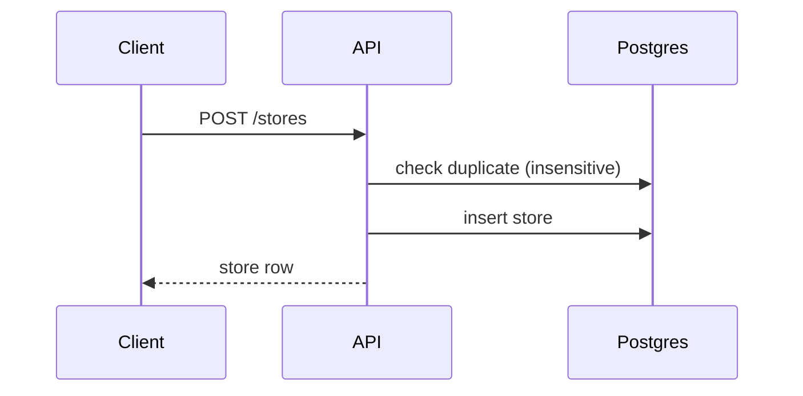
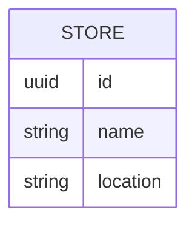

# Feature 05 — Store CRUD

## 1. Goal
Manage store records and make newly created stores immediately usable across mobile and admin.

## 2. User Flow
1. Admin or mobile sends `POST /stores`.
2. Backend validates and enforces unique store name (case-insensitive pre-check + unique constraint).
3. Mobile picker refreshes and preselects newly created store.
4. Store appears in Admin Stores page.

## 3. Screenshots
- Mobile inline store creation: `../screenshots/feature05-store-mobile.png`
- Admin stores page: `../screenshots/feature05-store-admin.png`

## 4. API Contract
- **Endpoints:**
  - `GET /stores`
  - `POST /stores`
- **POST request example:**
```json
{ "name": "Pingo Doce", "location": "Lisbon" }
```

## 5. Database Impact
- **Table:** `Store`
- **Indexes:** unique `name`, indexed `name`

## 6. Edge Cases
- Duplicate name (case-insensitive) => 409 conflict.
- Offline mode uses locally cached stores; sync button retries online pull.

## 7. Mermaid Diagrams



