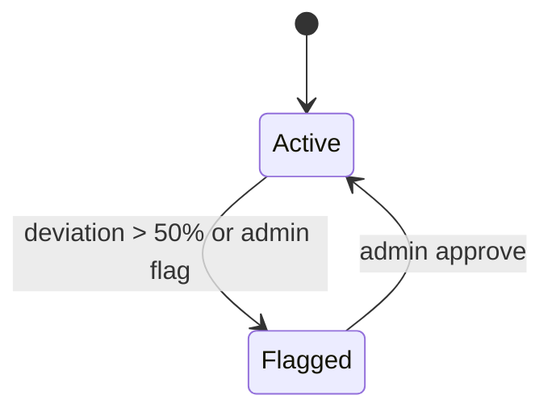
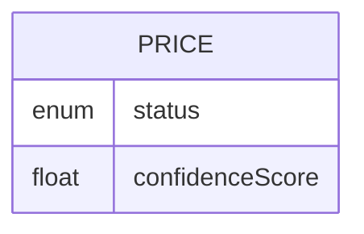

# Feature 06 — Price Moderation

## 1. Goal
Prevent bad price pollution using automatic outlier flagging and admin moderation workflow.

## 2. User Flow
1. Client submits price via `POST /prices`.
2. API computes deviation from active average.
3. If deviation > 50%, price auto-flags (`status=flagged`) and confidence lowers.
4. Admin reviews in moderation dashboard and approves/rejects with `PATCH /prices/:id/moderation`.
5. Mobile displays only active prices.

## 3. Screenshots
- API moderation logic evidence: `../screenshots/feature06-moderation-api.png`
- Admin moderation UI: `../screenshots/feature06-moderation-admin.png`

## 4. API Contract
- **Endpoints:**
  - `GET /prices/moderation?status=&limit=`
  - `PATCH /prices/:id/moderation`
- **PATCH request example:**
```json
{ "status": "active" }
```

## 5. Database Impact
- **Table:** `Price`
- **Columns:** `status`, `confidenceScore`
- **Indexes:** `status`, `(productId,status,priceCents)`

## 6. Edge Cases
- First price without baseline => high confidence and active by default.
- Extreme outlier auto-flagged and excluded from active views.

## 7. Mermaid Diagrams



