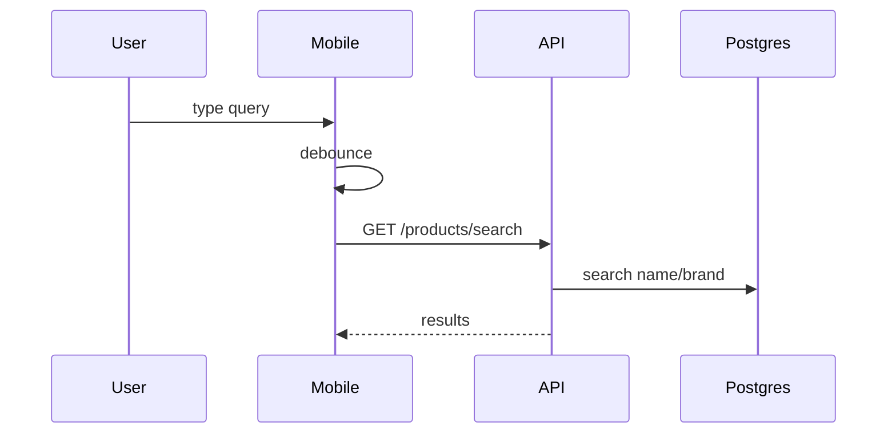
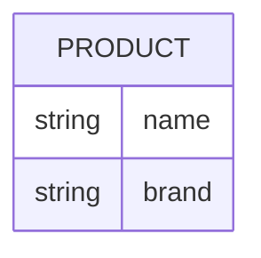

# Feature 07 — Product Search

## 1. Goal
Provide fast product lookup by name/brand from mobile Add Product flow.

## 2. User Flow
1. User opens mobile **Search products** screen (`/products/search`).
2. User types query; debounce timer (~280ms) triggers API call.
3. API `GET /products/search?q=&limit=` searches name + brand.
4. Results display in list; tapping result opens product detail.
5. Results are cached locally in SQLite.

## 3. Screenshots
- Mobile search UI: `../screenshots/feature07-search-mobile.png`
- API search endpoint evidence: `../screenshots/feature07-search-api.png`

## 4. API Contract
- **Endpoint:** `/products/search?q=&limit=`
- **Method:** `GET`
- **Response example:**
```json
[{ "id": "...", "name": "Milk", "brand": "BrandX", "barcode": "..." }]
```

## 5. Database Impact
- **Table:** `Product`
- **Indexes:** `@@index([name, brand])`

## 6. Edge Cases
- Empty query => no request.
- Render safety fix applied (`Text` inside button).
- API errors surface alert; existing cached products remain available.

## 7. Mermaid Diagrams



