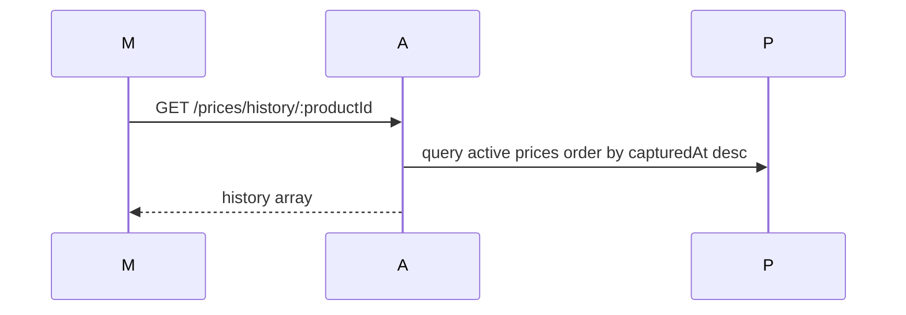
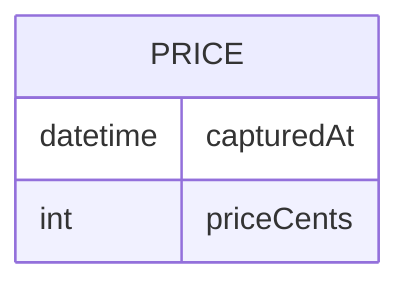

# Feature 08 — Price History

## 1. Goal
Display how product prices change over time.

## 2. User Flow
1. Product Detail loads.
2. Mobile calls `GET /prices/history/:productId`.
3. API returns active history ordered by `capturedAt DESC`.
4. Mobile renders simple list (store + date + price).

## 3. Screenshots
- Mobile history list: `../screenshots/feature08-history-mobile.png`
- API history route evidence: `../screenshots/feature08-history-api.png`

## 4. API Contract
- **Endpoint:** `/prices/history/:productId`
- **Method:** `GET`
- **Response example:**
```json
[
  { "store": { "name": "Store A" }, "priceCents": 299, "capturedAt": "..." },
  { "store": { "name": "Store B" }, "priceCents": 319, "capturedAt": "..." }
]
```

## 5. Database Impact
- **Table:** `Price`
- **Filter:** `status='active'`
- **Sort:** `capturedAt DESC`

## 6. Edge Cases
- No history => empty list state.
- Non-active/flagged rows excluded.

## 7. Mermaid Diagrams



