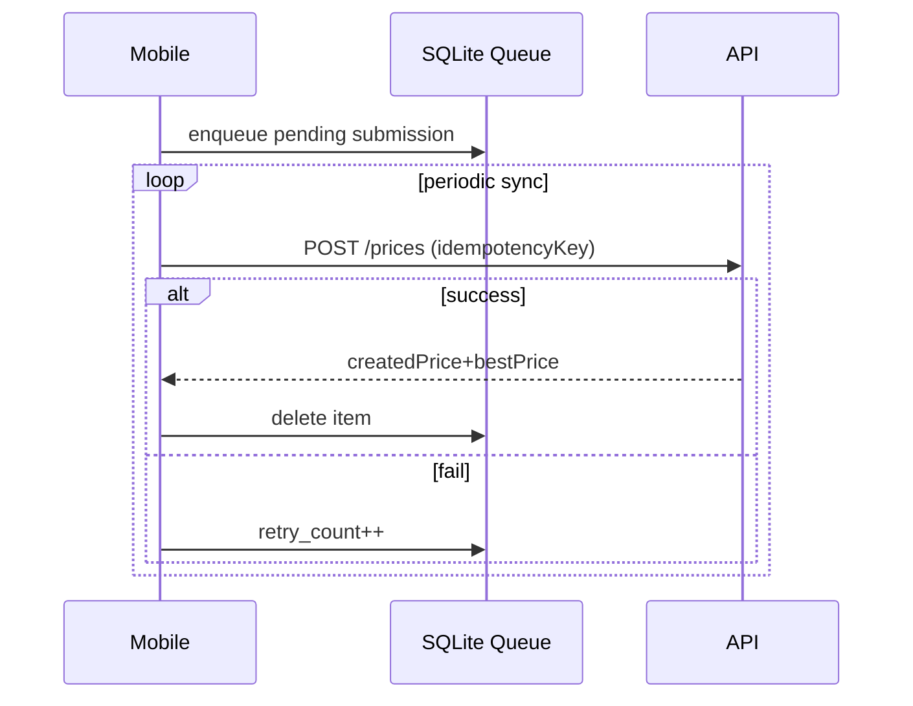
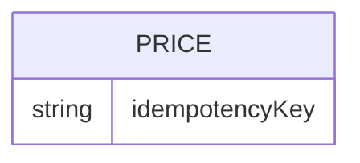

# Feature 09 — Offline Sync

## 1. Goal
Allow mobile pricing flow to work offline and sync automatically when online.

## 2. User Flow
1. User submits price while offline.
2. Mobile stores local price and queues pending submission with idempotency key.
3. On app startup/foreground/interval, sync worker retries queue.
4. API accepts idempotent POST and avoids duplicates.
5. On success, queue item removed and local cache updated.

## 3. Screenshots
- Mobile offline queue behavior: `../screenshots/feature09-offline-mobile.png`
- Backend idempotent evidence: `../screenshots/feature09-offline-api.png`

## 4. API Contract
- **Endpoint:** `/prices`
- **Method:** `POST`
- **Request additions:** `idempotencyKey`, optional `submittedBy`

## 5. Database Impact
- **Mobile SQLite table:** `pending_price_submissions`
- **Postgres column:** `Price.idempotencyKey` (unique)
- **Related local tables:** `prices`, `stores`, `products`

## 6. Edge Cases
- 4xx validation errors: queue item dropped (non-retriable).
- Network/5xx errors: queue retained and retry counter incremented.
- Store cache fallback used when API unavailable.

## 7. Mermaid Diagrams

