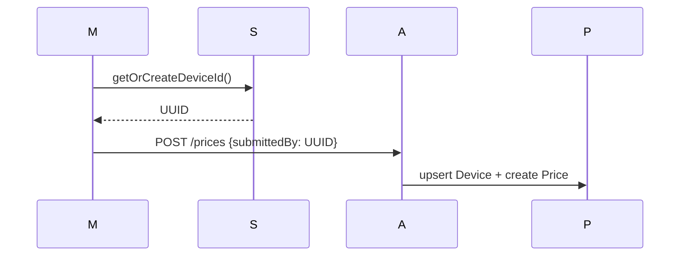
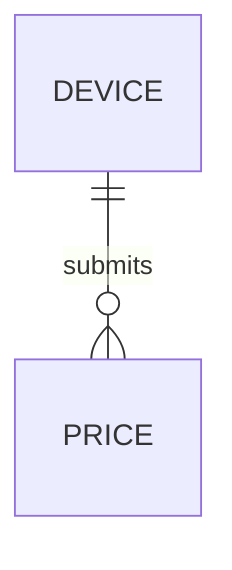

# Feature 10 — Anonymous Device Identity

## 1. Goal
Track submissions per anonymous device without full user authentication.

## 2. User Flow
1. On first app launch, mobile generates UUID.
2. UUID persisted locally in SQLite `app_identity`.
3. Price submissions send `submittedBy` with that UUID.
4. Backend upserts `Device` and links it to `Price` rows.

## 3. Screenshots
- Mobile identity persistence evidence: `../screenshots/feature10-device-mobile.png`
- Backend linkage evidence: `../screenshots/feature10-device-api.png`

## 4. API Contract
- **Endpoint:** `/prices`
- **Method:** `POST`
- **Request field:** `submittedBy` (device UUID)

## 5. Database Impact
- **Postgres tables:** `Device`, `Price(submittedBy FK)`
- **SQLite table:** `app_identity`

## 6. Edge Cases
- App data wipe/reinstall regenerates device UUID.
- Normal app restart/boot keeps same UUID.

## 7. Mermaid Diagrams

