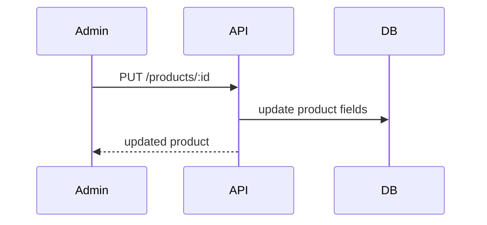
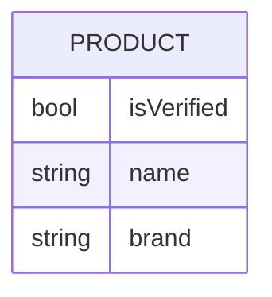

# Feature 11 — Product Editing in Admin

## 1. Goal
Allow operations team to override bad OpenFoodFacts product data and mark records verified.

## 2. User Flow
1. Admin opens Products list.
2. Admin clicks **Edit** for a product (`/products/[id]`).
3. Admin updates fields (name/brand/category/image/barcode/source) and toggles verified.
4. Admin saves via backend `PUT /products/:id`.
5. Updated DB values override OFF data and flow to mobile/backend consumers.

## 3. Screenshots
- Admin edit page: `../screenshots/feature11-edit-admin.png`
- API update evidence: `../screenshots/feature11-edit-api.png`

## 4. API Contract
- **Endpoints:**
  - `GET /products/id/:id`
  - `PUT /products/:id`
- **PUT request example:**
```json
{
  "name": "Corrected Name",
  "brand": "Corrected Brand",
  "isVerified": true,
  "source": "manual"
}
```

## 5. Database Impact
- **Table:** `Product`
- **Fields:** `isVerified`, mutable override fields (`name`, `brand`, etc.)

## 6. Edge Cases
- Duplicate barcode conflict => 409.
- Partial updates supported (PATCH also available).

## 7. Mermaid Diagrams



