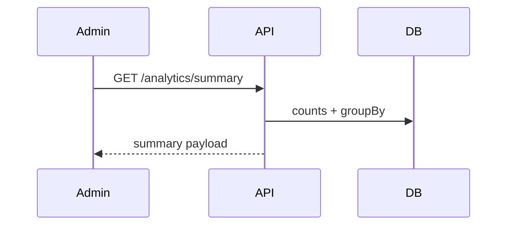
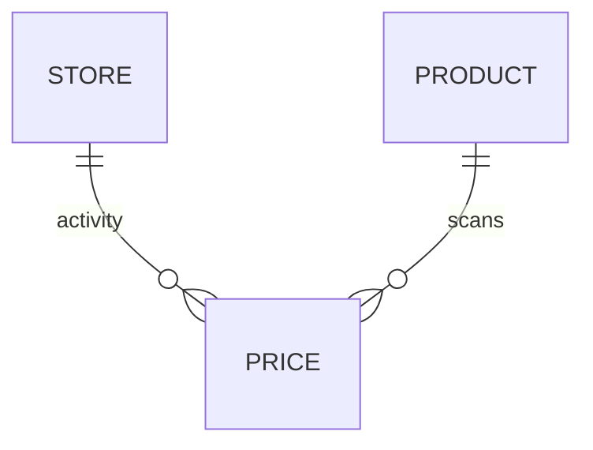

# Feature 12 — Basic Analytics

## 1. Goal
Provide dashboard-level operational analytics in admin.

## 2. User Flow
1. Admin dashboard loads.
2. Admin frontend calls `GET /analytics/summary?limit=5`.
3. API computes:
   - total products
   - total prices
   - most active stores
   - most scanned products
4. Dashboard renders summary cards and ranked lists.

## 3. Screenshots
- Admin analytics dashboard: `../screenshots/feature12-analytics-admin.png`
- API analytics evidence: `../screenshots/feature12-analytics-api.png`

## 4. API Contract
- **Endpoint:** `/analytics/summary?limit=`
- **Method:** `GET`
- **Response example:**
```json
{
  "totals": { "products": 123, "prices": 456 },
  "mostActiveStores": [{ "name": "Store A", "submissionsCount": 40 }],
  "mostScannedProducts": [{ "name": "Milk", "barcode": "...", "scansCount": 30 }],
  "generatedAt": "2026-02-25T10:00:00.000Z"
}
```

## 5. Database Impact
- **Tables:** `Product`, `Price`, `Store`
- **Operations:** `count`, `groupBy`, top-N sorting.

## 6. Edge Cases
- Empty datasets return zero counts and empty arrays.
- Limit param constrained by schema validation.

## 7. Mermaid Diagrams



