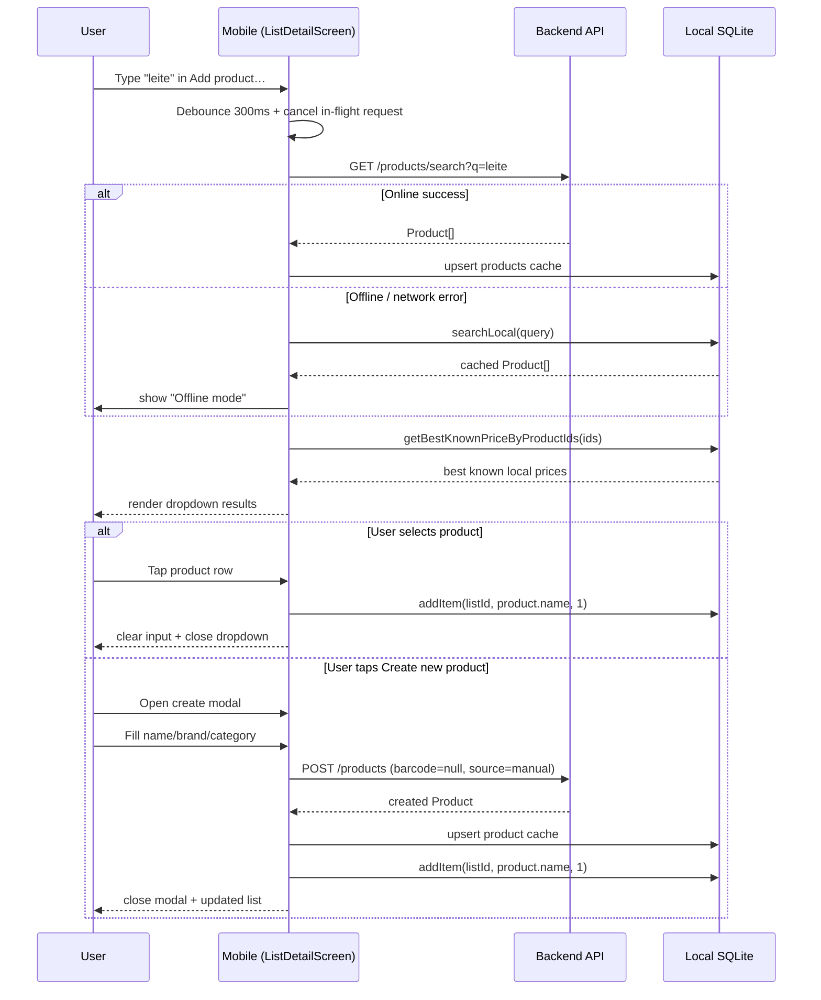

# Smart Add Product (Shopping List)

## Overview

Smart Add Product lets users add products into a shopping list directly from the list detail screen, with server-backed search, local cache upserts, offline fallback, and inline manual product creation.

## UX flow

- In list detail, a top input (`Add product…`) drives autocomplete.
- Search runs with 300ms debounce and cancels previous requests.
- Dropdown shows product rows (name, brand, image, best known price).
- If no suitable result, user can tap **Create new product**.
- New product modal captures name/brand/category and submits to backend with `barcode = null`.
- On success, product is cached locally and added to the current list.

## Mermaid sequence

## API contract

### 1) Search products

`GET /products/search?q=<query>&limit=<n>`

- Case-insensitive partial match (name/brand)
- Backed by indexed query path in Prisma (`@@index([name, brand])`)
- Returns shared `Product[]` schema

### 2) Manual product creation

`POST /products`

Request body supports:

- `name` (required)
- `brand` (nullable)
- `category` (nullable)
- `barcode` (nullable)
- `source` (`manual`)

Server behavior:

- Allows `barcode = null`
- Persists manual product
- Returns created `Product`

## SQLite caching logic

### Product cache upsert

`ProductRepository.upsertFromApiProduct()` now stores:

- `id`
- `barcode` (nullable)
- `name`
- `brand`
- `category`
- `imageUrl`
- `updatedAt`

### Local fallback search

`ProductRepository.searchLocal(query, limit)` performs case-insensitive local matching on:

- `name`
- `brand`

### Best known price enrichment

`PriceRepository.getBestKnownPriceByProductIds(ids)` returns lowest active local price per product for dropdown display.

## Offline fallback strategy

- Remote search errors (`ApiNetworkError`, `ApiTimeoutError`) trigger local search fallback.
- UI shows **Offline mode** banner.
- Product creation remains server-backed; if offline, modal shows actionable error.

## Duplicate prevention

- List add path uses repository de-dup behavior: adding the same item title in the same list increments quantity instead of creating duplicate rows.

## Evidence (runtime)

- A) Typing query: `docs/screenshots/product-search-01.png`
- B) Search dropdown results: `docs/screenshots/product-search-02.png`
- C) Create product modal: `docs/screenshots/product-search-03.png`
- D) Product added to list: `docs/screenshots/product-search-04.png`
- E) Backend creation proof (Swagger): `docs/screenshots/product-search-06.jpg`
- F) Local DB cached product (Prisma Studio): `docs/screenshots/product-search-07.png`
